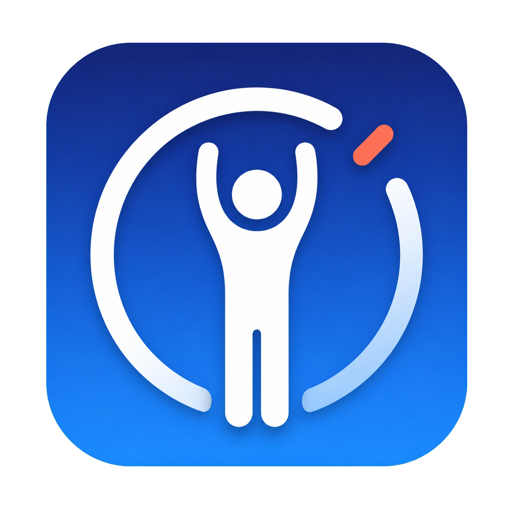

<p align="center">
  
</p>

<h1 align="center">Rest Reminder</h1>

A tiny native macOS menu bar app that reminds you to stand up and move at an interval you choose.

## Download and install

You do **not** need to download the source code or the entire GitHub repository.

1. Download the ready-to-use app: **[Rest-Reminder-macOS.zip](https://github.com/zhaotianjing/rest-reminder/releases/latest/download/Rest-Reminder-macOS.zip)**
2. Double-click the downloaded ZIP file to extract it.
3. Drag `Rest Reminder.app` into your **Applications** folder.
4. Double-click `Rest Reminder.app`. If macOS blocks it, click **Done** in the warning.
5. Open **System Settings > Privacy & Security**. Scroll down to the **Security** section and click **Open Anyway** next to the Rest Reminder message.
6. Authenticate with your password or Touch ID if asked, then click **Open** in the final confirmation.
7. Click **Allow** when macOS asks for notification permission.

The **Open Anyway** steps are only required for the first launch. If the app opens normally in step 4, skip steps 5 and 6.

Do not use **Code > Download ZIP** unless you specifically want the source code and plan to build the app yourself.

## Daily use

The timer starts as soon as the app opens. The default interval is 40 minutes, and your chosen interval is saved between launches. There is no persistent desktop window and no Dock icon.

Look for the standing-person icon in the top-right menu bar. Click it to:

- See the time remaining until the next reminder
- Choose any whole-minute interval from 1 to 480 minutes
- Send a test notification without resetting the timer
- See whether the last notification was accepted and delivered by macOS
- Pause or resume reminders
- Reset the timer using the selected interval
- Open macOS notification settings
- Quit the app

The app must remain running to send reminders. After restarting your Mac, open it again or follow the optional login-item instructions below.

## If a notification does not appear

1. Click the menu bar icon and choose **Send Test Notification**.
2. Check the **Notifications** and **Last notification** lines at the top of the menu.
3. If notifications or banners are disabled, choose **Open Notification Settings** and enable **Allow notifications** and **Show notifications on desktop** for Rest Reminder.
4. Check whether a Focus mode is active. Focus can hide notification banners.
5. In **System Settings > Notifications**, check the setting for notifications while mirroring or sharing the display. macOS can hide banners while screen sharing.

**Delivered** means macOS placed the notification in Notification Center. A Focus mode or the screen-sharing setting can still prevent a banner from appearing on screen.

## Start automatically after login (optional)

1. Open **System Settings**.
2. Go to **General > Login Items**.
3. Under **Open at Login**, click **+** and select `Rest Reminder.app` from your Applications folder.

## Features

- Lives only in the menu bar
- No desktop window and no Dock icon
- Supports a user-selected interval from 1 to 480 minutes
- Schedules reminders with macOS so sleep does not silently break the timer
- Includes a test notification, scheduling error reporting, and visible delivery status
- Shows the time remaining until the next reminder
- Supports pause, resume, reset, and quit
- No analytics, telemetry, accounts, or network access

## Requirements

- macOS 13 or later
- Apple silicon or Intel Mac

## Build from source (for developers)

The app uses only native macOS frameworks and the command-line tools included with Xcode or Apple Command Line Tools.

```sh
./build.sh
```

The app will be created at `dist/Rest Reminder.app`.

## Privacy

Rest Reminder runs entirely on your Mac. It stores only your selected interval and the most recent notification delivery status and time in your local macOS preferences. It does not connect to the internet, collect analytics, read your files, or send personal data anywhere. The only permission it requests is permission to display local notifications.

## License

MIT
